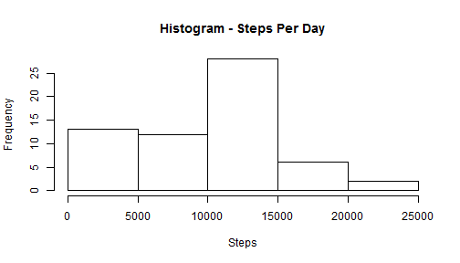
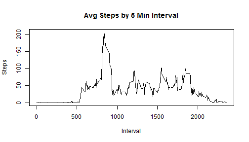
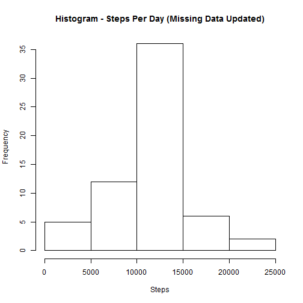
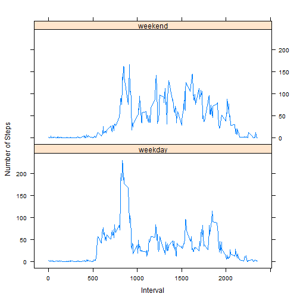

## Activity Data Analysis
** eatondl
** Reproducible Research - Project 1

### Load and Preprocessing Data


```r
library(sqldf)
```

```
## Loading required package: gsubfn
## Loading required package: proto
## Loading required package: RSQLite
## Loading required package: DBI
## Loading required package: RSQLite.extfuns
```

```r
library(timeDate)
library(lattice)
library(ggplot2)

setwd ("c:\\Users\\David\\Documents\\Activity")

## Read Activity.csv file
activity_data <- read.csv(file="activity.csv", header=T, sep=",")
head(activity_data)
```

```
##   steps       date interval
## 1    NA 2012-10-01        0
## 2    NA 2012-10-01        5
## 3    NA 2012-10-01       10
## 4    NA 2012-10-01       15
## 5    NA 2012-10-01       20
## 6    NA 2012-10-01       25
```

```r
## Sum for later mean analysis
sum_steps <- aggregate(steps ~ date, data = activity_data, sum, na.rm=T)
```


### What is mean total number of steps taken per day?

1.  Histogram of total number of steps taken each day.


```r
## Aggregate data by date
agg_activity <- tapply(activity_data$steps, activity_data$date, na.rm=T, sum)
mean_steps <-as.integer(mean(sum_steps$steps, na.rm=T))
median_steps <-as.integer(median(sum_steps$steps, na.rm=T))

## Histogram
hist(agg_activity, , xlab="Steps", main=paste("Histogram - Steps Per Day"))
```

 

2.  The total number of steps taken per day mean is: 10766 and the median is: 10765.

### What is the average daily activity pattern?

1.  Time series plot of 5 minute interval and average number of steps taken, averaged across all days.


```r
## Aggregate for all days
mean_interval <- aggregate(steps ~ interval, data=activity_data, na.rm=T, mean)

## 5 Min interval with max 
max_step_int <- stepsmean_interval$interval[mean_interval[2]==max(mean_interval$steps)]
```

```
## Error: object 'stepsmean_interval' not found
```

```r
## Plot time series
plot(mean_interval, main="Avg Steps by 5 Min Interval", xlab="Interval", ylab="Steps", type="l")
```

 

2.  5-minute interval with maximum number of steps:  `r max_step_int'.

### Inputting Missing Values


```r
## Count missing values
act_data_miss <- sum(!complete.cases(activity_data))
```
1.  Number of missing values in activity dataset:  2304.

2.  Missing values will be replaced with the mean from all records (excluding NAs) for that interval.

3.  R code below updates records in activity dataset with missing values with the average for that interval.

```r
## Aggregate activity data
mean_interval <- aggregate(steps ~ interval, data=activity_data, na.rm=T, mean)

## Create separate data frame for complete and records with missing values
act_comp <-activity_data[complete.cases(activity_data[,1:2]),]
act_miss <-activity_data[!complete.cases(activity_data[,1:2]),]

##  Create new dataset with updated values from mean_interval to replace missing values
act_miss_upd <- sqldf("select round(b.steps,0), a.date, b.interval
from act_miss a
join mean_interval b
on a.interval = b.interval")
```

```
## Loading required package: tcltk
```

```r
names(act_miss_upd)[1] <- paste("steps")

## Append complete and updated records together
upd_act_steps <- rbind(act_comp, act_miss_upd)

head(upd_act_steps)
```

```
##     steps       date interval
## 289     0 2012-10-02        0
## 290     0 2012-10-02        5
## 291     0 2012-10-02       10
## 292     0 2012-10-02       15
## 293     0 2012-10-02       20
## 294     0 2012-10-02       25
```

4.  Histogram of total number of steps taken each day after updating the missing values in the activity dataset.

```r
## Aggregate data for histogram
agg_upd_act_steps <- tapply(upd_act_steps$steps, upd_act_steps$date, na.rm=T, sum)

## Mean / Median Steps Per Day with updated data
sum_steps_upd <- aggregate(steps ~ date, data = act_miss_upd, sum)
mean_steps_upd <-as.integer(mean(sum_steps_upd$steps))
median_steps_upd <-as.integer(median(sum_steps_upd$steps))

## Histogram
hist(agg_upd_act_steps, , xlab="Steps", main=paste("Histogram - Steps Per Day (Missing Data Updated)"))
```

 

The total number of steps taken per day mean is: 10762 and the median is: 10762.  Impact of replacing NAs values in the activity dataset
had a minimal impact on mean (decreased by 4 steps) and median (decreased by 3 steps).  Updated dataset tended to move slightly more toward the median.

### Are there differences in activity patterns between weekdays and weekends?

1.  Add new factor variable to activity dataset to distinguish between "weekday" and "weekend".


```r
## Add new variable and default to weekday
week_work_activity <- upd_act_steps
week_work_activity <- cbind(WeekEnd_WeekDay='weekday', week_work_activity)

## Update variable "WeekEnd_WeekDay to weekend for weekend days 
week_work_activity <- transform(week_work_activity, WeekEnd_WeekDay=ifelse(isWeekend(week_work_activity$date)==TRUE,"weekend","weekday"))
head (week_work_activity)
```

```
##     WeekEnd_WeekDay steps       date interval
## 289         weekday     0 2012-10-02        0
## 290         weekday     0 2012-10-02        5
## 291         weekday     0 2012-10-02       10
## 292         weekday     0 2012-10-02       15
## 293         weekday     0 2012-10-02       20
## 294         weekday     0 2012-10-02       25
```

```r
## Aggregate data to plot
mean_interval_week <- aggregate(steps ~ interval+WeekEnd_WeekDay, data=week_work_activity, na.rm=T, mean)
mean_interval <- aggregate(steps ~ interval, data=activity_data, na.rm=T, mean)
```

2.  Panel plot of the 5 minute interval and average number of steps taken, averaged across all weekday and weekend days.


```r
# Set parameters to two by one panel
par(mfrow = c(2, 1))

## Plot time series
xyplot(steps ~ interval|WeekEnd_WeekDay, mean_interval_week, type="l", layout=c(1,2), ylab="Number of Steps", xlab="Interval")
```

 

On weekdays people tend to exercise in the morning prior to starting other activities, however on the weekend they tend to exercise throughout the day.
